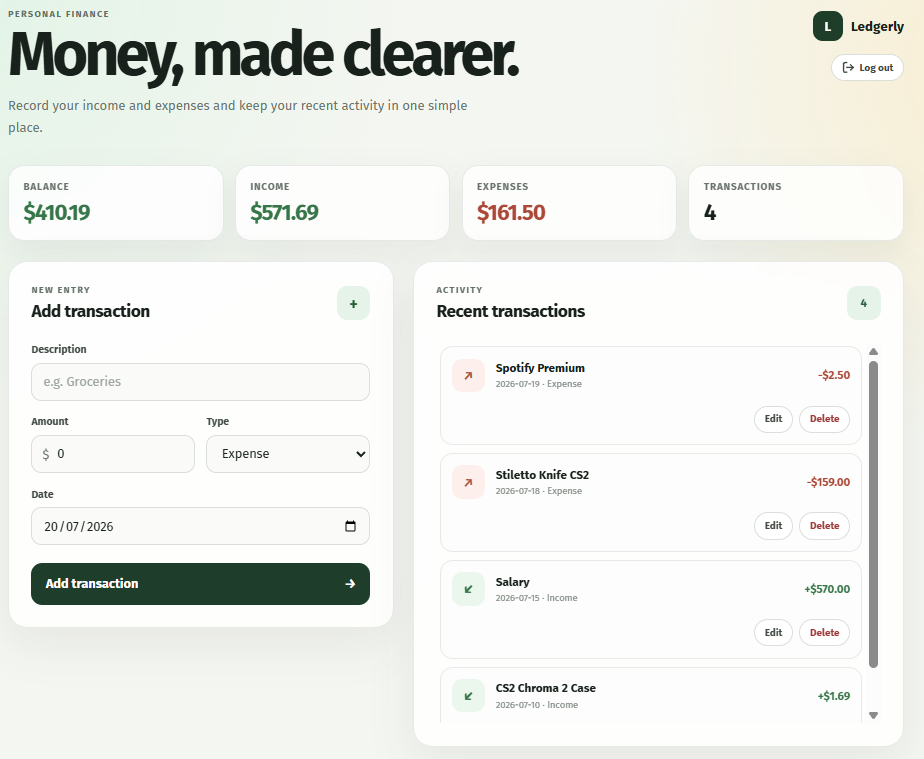
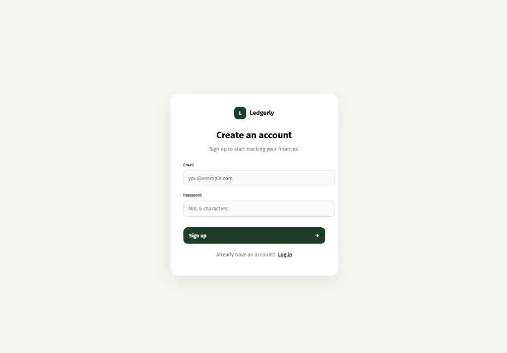
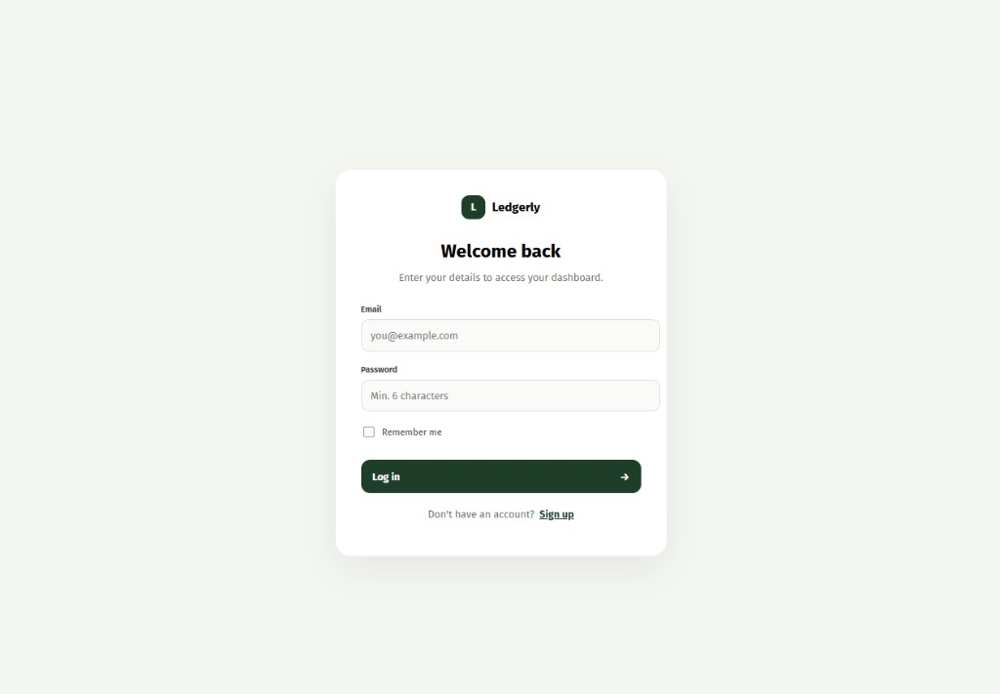

# Ledgerly

A simple personal finance tracker to record your income and expenses. Keep all your recent activity in one simple place.

## Previews

**Dashboard**  


**Sign Up**  


**Log In**  


## Getting Started

### Prerequisites
- Node.js
- Database (PostgreSQL/MySQL etc. configured via Prisma)

### Installation
1. Install dependencies for the backend and frontend:
   ```bash
   cd backend && npm install
   cd ../frontend && npm install
   ```
2. Set up the database and run Prisma migrations in the `backend`.
3. Start the backend development server.
4. Start the frontend Angular development server:
   ```bash
   cd frontend && npm start
   ```